# C#入门

> 程序思维题：

两根不均匀的香，烧完一根是1h，怎么用来计时15min呢？

思路：一根香从两头同时点燃烧完是30min，只需再对半即可，那么怎么对半呢？可以在第一根香两端同时点燃的时候也点燃第二根香的一端，这样，当第一根香烧完的时候第二根香还剩30min可以烧，这时候再点燃第二根香的另一端，开始计时，烧完则是在30min可烧的时间再次对半，即为15min。

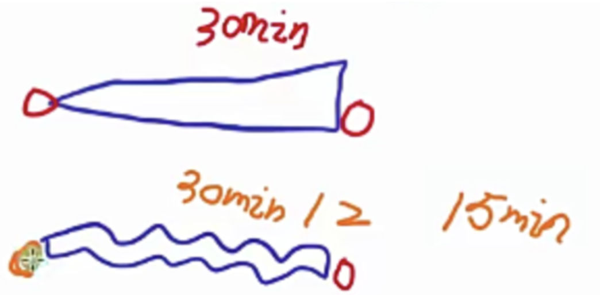

## C#基本结构

```cs
/// <summary>
/// 引用命名空间（工具包），相当于头文件
/// </summary>
using System;

/// <summary>
/// 命名空间（工具包），相当于自定义的头文件
/// </summary>
namespace lesson1;

/// <summary>
/// 类
/// </summary>
class Program
{
    /// <summary>
    /// 主函数
    /// </summary>
    /// <param name="args"></param>
    static void Main(string[] args)
    {
        ////WriteLine(),Write()
        //Console.WriteLine("自带换行的print");
        //Console.Write("不带换行的print");
        //Console.Write("你看就没有换行");

        ////ReadLine():输入完需要按回车
        //Console.WriteLine("请输入：");
        //Console.ReadLine();
        //Console.WriteLine("over");

        //ReadKey():输入一个键，自动回车
        Console.ReadKey();
        Console.WriteLine("\nover");
    }
}
```

## 注释

三杠注释：用来注释 类、函数

```cs
/// <summary>
/// 
/// </summary>
/// <param name="args"></param>
```

其他注释和c++一样

## 控制台函数

控制台输入：Console.ReadLine()、Console.ReadKey()
控制台输出：Console.WriteLine()、Console.Write()

//WriteLine():打印信息后换行
//Write():打印信息后不换行

```cs
Console.WriteLine("自带换行的print");
Console.Write("不带换行的print");
Console.Write("你看就没有换行");
```

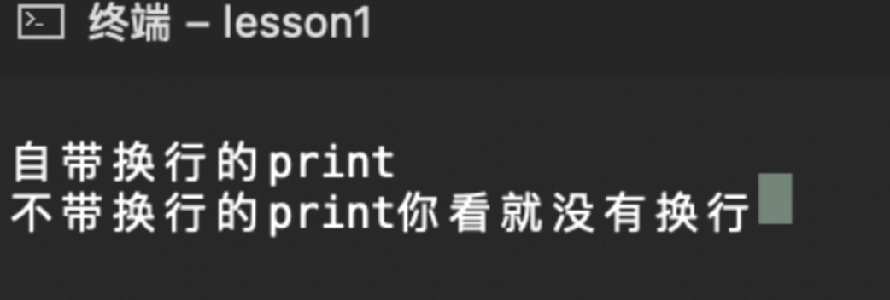//ReadLine():检测用户的一系列输入，回车结束
输入完需要按回车才结束

```cs
Console.WriteLine("请输入：");
Console.ReadLine();
Console.WriteLine("over");
```

//ReadKey():检测用户的一键输入，立刻结束
输入一个键，就结束

```cs
//ReadKey():输入一个键，自动回车
Console.ReadKey();
Console.WriteLine("\nover");
```

## 变量

1. 折叠代码

```cs
//折叠代码

# region 这是一段折叠的代码

# endregion
```

2. 变量

```cs

#region 变量
//有符号(signed)的整型变量
//sbyte -2^7 ~ 2^7-1 1字节

//short -2^15 ~ 2^15-1 2字节

//int -2^31 ~ 2^31-1 4字节

//long -2^63 ~ 2^63-1 8字节

//无符号(unsigned)的整型变量
//byte 0 ~ 2^8-1 1字节

//ushort 0 ~ 2^16-1 2字节

//uint 0 ~ 2^32-1 4字节

//ulong 0 ~ 2^64-1 8字节

//浮点型变量
//float 4字节，精度7位有效数字
//不加f后缀，默认是double类型
float f1 = 1.221312f;
//如果是一个整数也可以用float定义，且可以不写f后缀
float myHeight = 183;
//double 8字节，精度15位有效数字
double d1 = 1.2213124211249;
//decimal 16字节，精度28位有效数字

//其他类型变量
//bool 1字节，true或false
bool b1 = true;
bool b2 = false;
//可以与字符串相加
Console.WriteLine(b1 + "and" +b2);
//char 2字节，表示一个字符，用''
char c1 = 'a';
//string 字符串，没有上限，用""
string str1 = "hello world";

//注意修改变量直接再赋值就行了

#endregion
```

```cs
#region 潜在知识点
//拼接输出
int num = 1;
Console.WriteLine("num is :" + num);

#endregion

```

3. 同类型变量可以在同一行声明

```cs
int a = 1, b = 2;
```

4. 变量初始化：声明完变量最好立刻赋值。
5. 内存空间大小：

```

// sizeof()不能用来计算string类型，其他都可以
```

**题目**：


```cs
//有符号整型 字节 （位数=字节数*8）
sbyte 1
short 2
int   4
long  8
//无符号整型
byte   1
ushort 2
uint   4
ulong  8

//浮点数
float   4
double  8
decimal 16

//其他
bool   1
char   2
string
```

6. 声明变量

```cs
驼峰命名：变量
int playerName;
帕斯卡命名：类，函数
public void PlayerJump()
{

}
class PlayerJumpState
{

}
```

## 常量

```cs
#region 常量
//关键字：const

//声明的时候要带上类型
//必须初始化
//常量不能修改

const float PI = 3.1415926f;
const string userName = "飞舞";

#endregion
```

常量：用来声明一些不想被修改的变量

## 转义字符

```cs
#region 转义字符
// \' 单引号
// \" 双引号
Console.WriteLine("123\'123");
Console.WriteLine("123\"123");

// \\ 反斜杠
Console.WriteLine("123\\123");

// \n 换行
Console.WriteLine("123\n123");

// \t 制表符
Console.WriteLine("123\t123");

// \b 退格
Console.WriteLine("123\b123");

// \f 换页 就是上下行文本错开
Console.WriteLine("123\f123");

// \0 空字符
Console.WriteLine("123\0123");

// \a 系统警报音
Console.WriteLine("123\a123");

// 取消转义字符
Console.WriteLine(@"123\a123");

#endregion
```

## 类型转换

### 1. 隐式转换

规则：大范围装小范围

```csharp
        #region 隐式转换————同一大类型之间
  
        //有符号
        long l = 1;
        int i = 1;
        short s = 1;
        sbyte sb = 1;
        //下面用隐式转换：大范围装小范围的类型  long -> int -> short -> sbyte
        l = i;
        l = s;
        l = sb;
        //如果反过来装，则会数据溢出，报错
        //比如：i = l;错误

        //无符号
        ulong ul = 1;
        uint ui = 1;
        ushort us = 1;
        byte b = 1;
        //也是大范围装小范围的类型  ulong -> uint -> ushort -> byte

        //浮点数
        decimal de = 1.1m;
        double d = 1.1;
        float f = 1.1f;
        //decimal类型不能隐式转换，不能用来存储double和float
        //比如：de = d; 错误
        //但是float和double可以隐式转换   double -> float
        d = f;

        //特殊类型  bool char string
        //不是同一大类型，不存在隐式转换

        #endregion

```

```csharp
        #region 隐式转换————不同大类型之间
  
            #region 无符号和有符号之间
            //无符号
            byte b2 = 1;
            ushort us2 = 1;
            uint ui2 = 1;
            ulong ul2 = 1;
            //有符号
            sbyte sb2 = 1;
            short s2 = 1;
            int i2 = 1;
            long l2 = 1;

            //无符号装有符号    装不了，因为无符号不存在符号位
            //比如：b2 = sb2; 错误

            //有符号装无符号    能隐式转换的前提是有符号的范围要更大，才能装下无符号的范围
            i2 = b2;
            l2 = i2;
            // 比如：i2 = ui2; 错误

            #endregion

            #region 整型和浮点型之间
            //浮点数
            float f2 = 1.1f;
            double d2 = 1.1;
            decimal de2 = 1.1m;
  
            //浮点数装整数  浮点数可以装任意整数 还是大范围装小范围
            //decimal虽然不能隐式存储double和float，但是可以隐式存储整形
            f2 = i2;
            de2 = i2;
            /*总结*/
            // double -> float -> 所有整形（有无符号都行）
            // decimal -> 所有整形（有无符号都行）

            //整数装浮点数  不行，因为整数的范围比浮点数的范围小，而且整数也没小数位置


            #endregion

            #region 特殊类型和其他类型之间
            bool bo2 = true;
            char c2 = 'a';
            string str2 = "hello";
            //bool 不能和其他类型 相互隐式转换
                // i2 = bo2;
                // bo2 = i2;
                // 均报错
            //char 不能隐式转换成其他类型，但是可以隐式转换成整形浮点型大范围的类型
                // c2 = i2; 报错
                i2 = c2;
                f2 = c2;
            //string 不能和其他类型 相互隐式转换
                // str2 = i2;
                // i2 = str2;
                // 均报错
  


            #endregion


        #endregion

```

**题目：**

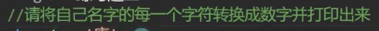

*~~哈哈，这里出现了一个搞心态的markdown bug，就是如果图片地址有特殊符号，比如这个md文件名有#符号，那粘贴过来的图片会显示地址不存在。~~*

```csharp
       //作业：
        int tang = '唐';
        int lao = '老';
        int shi = '狮';
        Console.WriteLine("名字："+tang+lao+shi);//前面是字符串，后面相连也就是字符串拼接

```

### 2.显式转换

#### 2.1 括号强转

(目标类型)源类型变量名

```csharp
        #region 显式转换————括号强转
            //用于：将高精度的类型强制转换为低精度的类型
	    //	低精度 装 高精度， 大范围存小范围
            //语法： (目标类型) 源类型变量名
	    // long l1 = 1;
            // int i1 = (int) l1;
            //long l1 = (long) i1; 错误，低精度不能强转高精度，也就是高精度不能存放低精度

            //注意：精度问题(浮点数) 范围问题
            //相同大类的整形
            sbyte sb1 = 1;
            short s1= 1;
            int i1 = 1;
            long l1 = 1;

            s1 = (short)i;//小存大会因为范围产生异常，但不会报错
  
            //浮点数
            float f1 = 1.1f;
            double d1 = 1.1124234213f;
            decimal de1 = 1.1m;

            f1 = (float)d1; //小存大会精度丢失，但不会报错
            Console.WriteLine(f1);

            //无符号和有符号
            uint ui1 = 1;
            i1 = (int)ui1;
            Console.WriteLine(i1);
            i1 = -1;
            ui1 = (uint)i1; //无符号存有符号，会因为缺少符号位产生异常，但不会报错
            Console.WriteLine(ui1);
  
            //浮点和整形
            i1 = (int)f1;//整形存浮点会精度丢失
            Console.WriteLine(i1);
            f1 = (float)i1;//浮点存整形肯定没问题
            Console.WriteLine(f1);

            //char和数值类型
            i2 = 'a';
            char c = (char)i2;//对应ASCII码转字符，来回都能转
            Console.WriteLine(c);
            f1 = 97.2f;
            c = (char)f1;//char存浮点数，会自动舍去小数位后映射到ASCII码
            Console.WriteLine(c);

            //bool 和 string 都不能通过括号强转
            bool bo1 = true;
            //  i1 = (int)bo1;//报错
            string str1 = "123";
            // i1 = (int)str1;//报错


        #endregion

```

#### 2.2 Parse 法

目标类型.Parse(字符串)

```csharp
        #region 显式转换————Parse法
        //作用： 把string转换成其他类型（前面有提到，string不能括号强转）
        //语法： 目标类型.Parse(string类型变量名)  
        //      目标类型.Parse("字符串")
        //注意：字符串必须能够转换成对应类型才行，否则会报错

        //整形
  
        int i4 = int.Parse("123");
        Console.WriteLine(i4);

        //i4 = int.Parse("123.45"); //异常了，报错，编译不通过
        //Console.WriteLine(i4); 

        // short s4 = short.Parse("6666666"); //超出范围，报错
        // Console.WriteLine(s4);

        //浮点型 和上面一样

        // bool 字符串必须是true或false，否则会报错
        bool b5 = bool.Parse("true");
        Console.WriteLine(b5);
  
        // char  字符串必须是单个字符，否则会报错
        char c5 = char.Parse("a");
        Console.WriteLine(c5);


        #endregion

```

#### 2.3 Convert 法

Convert.To目标类型(源类型变量名/常量名)

```csharp
        #region 显式转换————Convert法
        //作用： 更准确地在各个类型之间转换
        //语法： Convert.To目标类型(源类型变量名/常量名)
        //      Convert.ToInt32()
        //      Convert.ToInt16() 相当于short
        //      Convert.ToInt64() 相当于long

        //      Convert.ToSingle() Single就是单精度，相当于float
        //      Convert.ToDouble() 相当于double
        //      Convert.ToDecimal() 相当于decimal

        //      Convert.ToSByte()
        //      Convert.ToByte()
        //      Convert.ToBoolean()
        //      Convert.ToChar()
        //      Convert.ToString()
        //注意： 填写的变量/常量必须是可以转换的类型，否则会报错
        //Conver.ToInt32(string)
        int i3 = Convert.ToInt32("123");
        Console.WriteLine(i3);
        //Conver.ToInt32(浮点数) 会四舍五入
        i3 = Convert.ToInt32(1.5f);
        Console.WriteLine(i3);
  
        //Conver.ToInt32(bool)
        i3 = Convert.ToInt32(true);
        Console.WriteLine(i3);
        i3 = Convert.ToInt32(false);
        Console.WriteLine(i3);

        //其他类型也能转
        bool b3 = Convert.ToBoolean(312);
        Console.WriteLine(b3);

        #endregion

```

#### 2.4 ToString()

*其他类型转成字符串*

源类型变量.toString()

```csharp
        #region 显式转换————其他类型转string
        //作用：拼接打印
        //语法： 源变量.ToString()

        string str3 = 1.ToString();
        Console.WriteLine(str3);

        string str4 = true.ToString();
        Console.WriteLine(str3);

        string str5 =  1.2f.ToString();
        Console.WriteLine(str3);

        //下面两个是等价的
        Console.WriteLine("1"+true+1.2f);//实际运行的时候自动调用toString()方法
        Console.WriteLine(str3+str4+str5);
  
        #endregion
  
```

> **题目：**

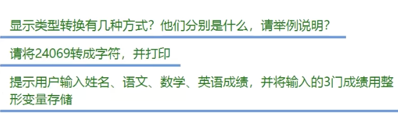

4种：

括号强转 int i1 = (int)"123";

Parse法 i1 = int.Parse("123");

Convert法 i1 = Convert.ToInt32(1.2f);

ToString()法 string st1 = 1.ToString();

---

注意是转成字符，不是字符串

```csharp
//char只能隐式转换成其他大范围的类型，而不能隐式存放其他类型
        char c1 = (char)24069;
        Console.WriteLine(c1);

        c1 = Convert.ToChar(24069);
        Console.WriteLine(c1);
```

---

```csharp
        //题目3:
        Console.WriteLine("请按语文数学英语的顺序，输入三门成绩：");
        Console.WriteLine("输入语文成绩：");
        int chinese = Convert.ToInt32(Console.ReadLine());
        //或者：int chinese = int.Parse(Console.ReadLine());
        Console.WriteLine("输入数学成绩：");
        int math = Convert.ToInt32(Console.ReadLine());
        Console.WriteLine("输入英语成绩：");
        int english = Convert.ToInt32(Console.ReadLine());

        Console.WriteLine("Chinese: {0}\nMath: {1}\nEnglish: {2}",chinese,math,english);
        //或者：Console.WriteLine("Chinese:"+chinese+"\n"+"Math:"+math+"\n"+"English:"+english);  


  
```

## 异常捕获

```csharp
        #region 语法
        try{
            Console.WriteLine("请输入:");
            string str1 = Console.ReadLine();
            int i1 = int.Parse(str1);
            Console.WriteLine(i1);
        }
        catch{
            Console.WriteLine("你输入的不合法");
        }
        finally{
            Console.WriteLine("请输入合法数字!!!");
        }
        #endregion
```

> 练习题：
>
> 

```csharp
        try{
            Console.WriteLine("请输入一个数字:");
            string str2 = Console.ReadLine();
            int i2 = int.Parse(str2);
        }
        catch{
            Console.WriteLine("你输入的不合法");
        }
```

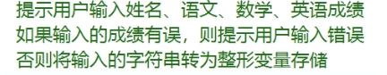

```csharp
        try{
            Console.WriteLine("请输入姓名:");
            string str3 = Console.ReadLine();
            Console.WriteLine("请输入成绩1:");
            string str4 = Console.ReadLine();
            int i4 = int.Parse(str4);
            Console.WriteLine("姓名:" + str3 + " 成绩1:" + i4 + "\n");

        }
        catch{
            Console.WriteLine("你输入成绩1不合法");
        }

       try{
            Console.WriteLine("请输入成绩2:");
            string str5 = Console.ReadLine();
            int i5 = int.Parse(str5);
            Console.WriteLine(" 成绩2:" + i5 + "\n");

        }
        catch{
            Console.WriteLine("你输入成绩2不合法");
        }
```

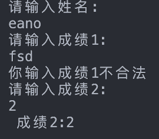

可以知道哪一步不合法

## 运算符

### 算术运算符

#### 除法：/

整形的除法运算会丢失小数部分，要用浮点数存储要在运算时有浮点数特征，比如其中一个数加上f后缀⬇️

```csharp
float f = 1f / 2;
```

#### 取余数：%

整数和浮点数可以取余数，bool等其他类型不能

```csharp
        float a = 4.11f % 3.11f;
        Console.WriteLine(a);
```

#### 优先级

先乘除取余 后 加减

#### 自增自减

```csharp
        int a1 = 1, a2 = 1;
        //先用后变
        Console.WriteLine(a1++ +" "+ a2--);
  
        int a3 = 1, a4 = 1;
        //先变后用
        Console.WriteLine(++a3 +" "+ --a4);
```


> 练习题：
>
> 

法1：中间商

```
int a = 1,b = 2;
int temp = a;
a = b;
b = temp;

```

法2：加减法（节省一个变量）

```csharp
int a = 1,b = 2;
a = a + b;
b = a - b;
a = a - b;
```

```csharp
        #region 练习题
        int seconds = 987652;
        int one_day = 60 * 60 * 24;
        int one_hour = 60 * 60;
        int one_minute = 60;
        int one_second = 1;
        Console.WriteLine(seconds/one_day+"天"+seconds%one_day/one_hour+"小时"+seconds%one_hour/one_minute+"分"+seconds%one_minute+"秒");
        #endregion

```

### 字符串拼接

#### 只用+和+=

```csharp
        #region 字符串拼接
        string str3 = "1";
        str3 += "2";
        Console.WriteLine(str3);
        str3 += 1;
        Console.WriteLine(str3);
        str3 += 1 + 2;
        Console.WriteLine(str3);
        str3 += "" + 3 ;
        Console.WriteLine(str3);


        #endregion
```

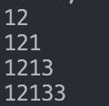

```csharp
        str3 = "";
        str3 += 1 + 2 + "" + 2 + 3;
        Console.WriteLine(str3);
```

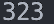

先计算""前面的，再和""以及后面的拼接

#### string.Format()

string.Format("待拼接的内容",内容0,内容1, ...);

```csharp
        #region 拼接法2
        //语法：string.Format("格式化字符串",参数1,参数2,参数3...)
        //格式化字符串里想要拼接的内容用占位符{i}替代，从0开始依次往后
        string str4 = string.Format("我是{0},今年{1}岁,身高{2}cm","sb",18,180);
        Console.WriteLine(str4);
        #endregion 
```

#### 控制台打印拼接

```csharp
        #region 控制台打印拼接
        Console.WriteLine("我是{0},今年{1}岁,身高{2}cm", "sb", 18, 180);
        #endregion
```

注意：后面的内容0,1,...可以多填(只是不拼接)，但不能少填(会报错)

### 条件运算符

特殊类型char string bool只能同类型== 或 !=

char可以和自己或数值类型比较（ascii码）

### 逻辑运算符

```csharp
            #region 逻辑与 &&
            bool result1 = true && false;
            Console.WriteLine(result1); // false
            #endregion

            #region 逻辑或 ||
            bool result2 = true || false;
            Console.WriteLine(result2); // true
            #endregion
      
            #region 逻辑非 !
            bool result3 = !true;
            Console.WriteLine(result3); // false
            #endregion
```

优先级：! > 算数运算符 > && > ||

#### 逻辑运算符短路规则

```csharp
            #region 短路规则
            int i3 = 1;
            bool result = i3 > 0 || ++i3 >0;
            Console.WriteLine(i3); // 1
            result = i3 < 0 && ++i3 >0;
            Console.WriteLine(i3); // 1
            #endregion
```

||是有真则真，如果左边就是真，就跳过后面。

&&是有假则假，如果左边就是假，就跳过后面。

### 位运算符

按位与&，按位或|，按位取反~，异或^，左移<<，右移>>

也就是换成二进制后进行位运算，最后结果再转回十进制

**异或^**：不同为1，相同为0

```csharp
Console.WriteLine(1 ^ 5);
// 001
//^101
// 100 结果4
```

**按位取反~**

补码和原码是互逆的，操作都是反码+1

反码：负数除符号位按位取反，正数不变

```csharp
        #region 位运算符
        // 位取反 ^
        int a = 5;
        // 0000 0000 0000 0000 0101
        // 1111 1111 1111 1111 1010 这样按位取反得到的是补码，还需要找到其原码
        // 1000 0000 0000 0000 0101 + 1
        // 1000 0000 0000 0000 0110 而最高位符号位是1，所以是-6
        Console.WriteLine(~a); // -6
        #endregion
```

**按位左移右移<<      >>**

左移几位 右侧加几个0

右移几位 右侧去掉几个数

### 三目运算符

 条件语句 ? 条件为真返回内容1 : 条件为假返回内容2;

注意：和c语言不一样的地方

三目运算符有返回值，必须使用(也就是必须赋值给变量)

返回值的类型必须一致

```csharp
        #region 三目运算符
        string str4 = (1>0)?"大于0":"小于等于0";
        Console.WriteLine(str4); // 大于0
        // str4 = (1>0)?"大于0":1; 错误，返回值类型不统一

        #endregion
```

### if语句

> 习题
>
> 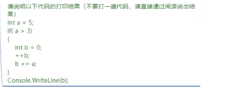

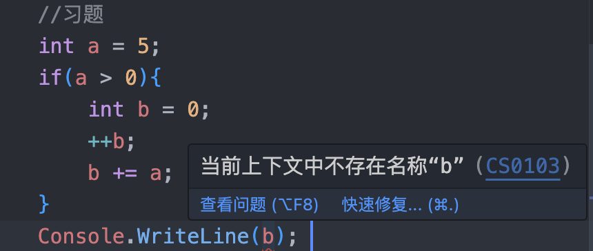

打印语句写进if里面或者在if前面定义b才行，因为b这个变量是在if里面定义的

### switch语句

```csharp
        // switch(变量){
        //     case 值1:
        //         //变量==值1则执行代码块1;
        //         break;
        //     case 值2:
        //         //变量==值2则执行代码块2;
        //         break;
        //     default:
        //         //默认代码块;
        //         break;
        // }
```

注意：switch语句中的值1,2,...必须是常量，不能条件语句

#### 可以自定义常量

用const自定义常量，然后把这个常量名放在值1,2,...中

```csharp
        char c = 'a';
        const char c2 = 'a';
        switch(c)   // switch语句
        {
            case c2:
                Console.WriteLine("c等于c2");
                break;
        }
```

#### 贯穿

如果某几个case所要执行的语句一样，可以只在最后一个case中写即可

```csharp
        int c = 0;
        switch(c)   // switch语句
        {
            case 1:
            case 2:
            case 3:
                Console.WriteLine("哈哈哈");
                break;
            case 4:
                Console.WriteLine("呵呵呵");
                break;
            default:
                Console.WriteLine("啥也没有");
                break;
        }
```

注意：和c语言不同的地方

写一个case必须跟一个break，不能省略

### 循环语句

#### while

注意：

在每个循环体/if语句内定义的变量是局部变量，在外面不能使用，因此每个循环体内的变量之间没有关系，可以重复变量名，但最好不要这样做😁

##### 流程控制关键字：

break: 跳出while循环

continue: 跳回循环开始，也就是判断条件处继续执行

```csharp
        #region while
        // 流程控制关键字break和continue
        while(true){
            Console.WriteLine("break前");
            break;
            Console.WriteLine("break后");
        }
        Console.WriteLine("循环体外");
        #endregion
```


注意break跳出的是while循环

但是嵌套语句里有for/switch的时候break是和for/switch配套的，这时候就不是跳出while了，但是continue是和while配套的

```csharp
        // 流程控制关键字break和continue
        int i = 0;
        while(true){
            ++i;
            Console.WriteLine(i);
            if(i==3){
                break;
            }
        }
        Console.WriteLine(i);
```

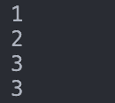

```csharp
        while(true){
            Console.WriteLine("continue前");
            continue;
            Console.WriteLine("continue后");
        }
        Console.WriteLine("循环结束");
```

结果会一直输出"continue前"

> 题目

```csharp
        // 题目：打印1～20的奇数
        int i = 0;
        while(i <= 20){

            if(i % 2 == 1){
                Console.WriteLine(i);
                i+=2;
            }
            else{
                i++;
                continue;
            }
        }
```

> 题目
>
> 斐波那契数列第20个数

```csharp
        int first_num = 0, second_num=1, third_num=0, count=1;
        while(first_num<100000){
      
            third_num = first_num + second_num;
            first_num = second_num;
            second_num = third_num;
            Console.WriteLine(first_num);  
            count++;
            if(count == 20){
                Console.WriteLine("斐波那契数列的第20个数是："+third_num);
                break;
            }
        }
```

> 题目
>
> 100以内的素数

```csharp
        //题目：求100以内的素数
        int num = 2;
        while(num < 100){
            bool isPrime = true;
            for(int i = 2; i < num; i++){
                if(num % i == 0){
                    isPrime = false;
                    break;
                }
                else{
                    isPrime = true;
                }
            }
            if(isPrime) Console.WriteLine(num);
      
            num++;
        }
```

#### do while

先斩后奏，先执行一次循环体，再判断是否继续

注意：while后面有分号

```csharp
        //do while 循环
        do{
            Console.WriteLine("do while 循环");
        }while(false);
```

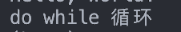

do while中的continue和break

continue是回到while的条件语句

```csharp
        //do while 循环
        do{
            Console.WriteLine("do while 循环");
            continue;
        }while(false);
```

结果和上面一样

#### for循环

continue和break的用法和while一样，所以需要注意配套使用，不能跨级使用

和while的区别：

for循环可以用来准确的到一个范围内的所有数

> 习题：
>
> 经典水仙花数

```csharp
        //水仙花
        int ge = 0, shi = 0, bai = 0, num = 0;

        for(; num <= 999; num++){
            bai = num / 100;
            shi = num % 100 / 10;
            ge = num % 10;
            if(num == ge * ge * ge + shi * shi * shi + bai * bai * bai){
                Console.WriteLine(num);
            }
        }
```
